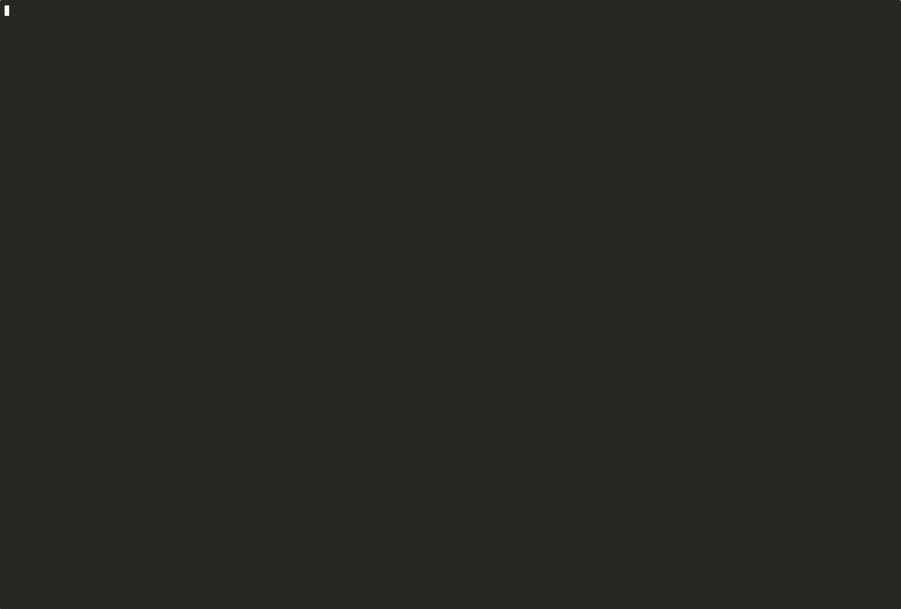

# Agent Black Box

**Flight recorder, replay, diff, and incident reporting for AI agent runs.**



Agent Black Box helps you understand what an AI agent actually did, where it failed, and what changed between runs.

It is built for people working with coding agents, tool-using assistants, MCP workflows, shell-executing automations, and long-running agent sessions that are too powerful to debug with plain chat transcripts.

## Why this exists

AI agents behave like systems, but most teams still debug them like chat logs.

That is the gap.

When an agent run goes wrong, people usually want answers to questions like:
- what actually happened?
- which step caused the failure?
- what changed between the bad run and the good run?
- which command, tool call, or prompt introduced the problem?
- what can I share with someone else without leaking secrets?

Most current tooling is weak at that.

Agent Black Box is meant to be the missing operational layer.

## What it does today

Current MVP features:
- ingest generic JSONL traces
- ingest real OpenClaw session JSONL traces and legacy OpenClaw-style example JSONL
- render a timeline of a run
- compare runs with raw event diff or focused diff summary modes
- export an incident-style markdown summary
- filter events by kind
- redact common secret-bearing fields
- write output to files for sharing

## Quick demo

If you only look at one thing, look at the real OpenClaw example below. That is the closest thing to the product's actual wedge right now.

### Timeline

```bash
PYTHONPATH=src python -m agent_black_box.cli timeline examples/sample_trace.jsonl --redact --banner
```

### Diff two runs

```bash
PYTHONPATH=src python -m agent_black_box.cli diff examples/sample_trace.jsonl examples/sample_trace_fixed.jsonl
PYTHONPATH=src python -m agent_black_box.cli diff examples/sample_trace.jsonl examples/sample_trace_fixed.jsonl --focus
```

### Export incident summary

```bash
PYTHONPATH=src python -m agent_black_box.cli summary examples/sample_trace.jsonl --redact --output incident.md
```

### Parse an OpenClaw-flavored trace

```bash
PYTHONPATH=src python -m agent_black_box.cli timeline examples/openclaw_trace.jsonl --format openclaw-jsonl
```

### Parse a real OpenClaw session

```bash
PYTHONPATH=src python -m agent_black_box.cli timeline ~/.openclaw/agents/main/sessions/<session>.jsonl --format openclaw-jsonl --compact
PYTHONPATH=src python -m agent_black_box.cli summary ~/.openclaw/agents/main/sessions/<session>.jsonl --format openclaw-jsonl --compact --output incident.md
PYTHONPATH=src python -m agent_black_box.cli diff ~/.openclaw/agents/main/sessions/<run-a>.jsonl ~/.openclaw/agents/main/sessions/<run-b>.jsonl --format openclaw-jsonl --compact --focus
./scripts/demo-gif-sequence.sh
```

## Real OpenClaw example

Below is a compact real-session excerpt from an OpenClaw run that inspected cron state and then edited a Discord status message.

You can also view the same excerpt in `assets/openclaw-real-snippet.txt` for easy screenshotting or terminal-demo capture.

```text
run_id: 5522c802-eade-41d5-b67c-0179806b11bf
agent: openclaw
events: 16 shown / 23 total
view: compact

Timeline
--------
01. [2026-04-14T12:34:45.292Z] prompt (user)  | message=[cron:bb948795-87a9-4a64-af5a-6c71ef93f3c6 Mission control live status updater] Edit an existing Discord message...
02. [2026-04-14T12:34:50.738Z] tool_call (assistant)  | tool=read, arguments={path=/opt/homebrew/lib/node_modules/openclaw/skills/discord/SKILL.md}
03. [2026-04-14T12:34:59.887Z] tool_call (assistant)  | tool=cron, arguments={action=list}
04. [2026-04-14T12:34:59.887Z] tool_call (assistant)  | tool=sessions_list, arguments={activeMinutes=180, limit=100, messageLimit=1}
05. [2026-04-14T12:35:16.023Z] tool_call (assistant)  | tool=message, arguments={action=edit, messageId=1492611694000734368, to=channel:1492607333183000789}
06. [2026-04-14T12:35:16.293Z] tool_result (message)  | tool=message, is_error=False, details={ok=True}
07. [2026-04-14T12:35:22.511Z] assistant_message (assistant)  | message=NO_REPLY

filtered: 7 event(s) (assistant_thinking=3, model-snapshot=1, model_change=1, session_start=1, thinking_level_change=1)
```

Full generated demo artifacts live in `demo/`:
- `demo/openclaw-real-timeline.md`
- `demo/openclaw-real-summary.md`
- `demo/openclaw-real-diff.md`

Recommended artifact order for demos:
- show `demo/openclaw-real-timeline.md` first
- use `demo/openclaw-real-summary.md` as the credibility follow-up
- use `demo/openclaw-real-diff.md` in focused mode for run-comparison storytelling
- keep raw event-by-event diffing as a technical appendix until alignment improves

## Example output

```text
run_id: run-001
agent: openclaw
session_id: sess-123
events: 2

timeline:
01. [2026-04-13T22:00:03Z] tool_result (github)  | status=failure, message=Validate PR Title failed
02. [2026-04-13T22:00:09Z] command (shell)  | command=gh pr edit 198 --title 'chore(llm): relax litellm version cap'
```

## What Agent Black Box Is

Agent Black Box is a local-first runtime telemetry and analysis tool for agent workflows.

It is designed to:
- ingest raw runtime events from different sources
- normalize them into a stable trace shape
- reconstruct readable timelines
- compare runs side by side
- export incident-friendly summaries
- support redacted sharing
- make real agent sessions legible enough to demo and debug

## What It Is Not

Agent Black Box is not:
- another chat UI
- a generic prompt library
- an assistant memory graph
- a vector database product
- a replacement for long-term memory systems

That distinction matters.

**Fredsidian** is about long-term memory and context architecture.

**Agent Black Box** is about runtime history, telemetry, replay, and blame.

## Repository Layout

```text
agent-black-box/
  README.md
  LICENSE
  CONTRIBUTING.md
  SECURITY.md
  docs/
    architecture.md
    faq.md
    launch-plan.md
    quickstart.md
    roadmap.md
    trace-schema.md
  examples/
    sample_trace.jsonl
    sample_trace_fixed.jsonl
    openclaw_trace.jsonl
  src/
    agent_black_box/
      adapters.py
      cli.py
      diffing.py
      filtering.py
      models.py
      parser.py
      redaction.py
      reporting.py
      timeline.py
  tests/
```

## Quickstart

See:
- `docs/quickstart.md`

## Roadmap

See:
- `docs/roadmap.md`

## Launch and exposure materials

See:
- `docs/launch-plan.md`
- `docs/exposure-copy.md`
- `docs/demo-script.md`

## Status

This is an early MVP being shaped into a public open source release.

It already has a real CLI and a real trace model, and it now supports real OpenClaw session traces, compact views, and focused diff summaries, but the strongest next steps are:
- better diff alignment and first-bad-step detection
- replay support
- root-cause hints
- a web UI
